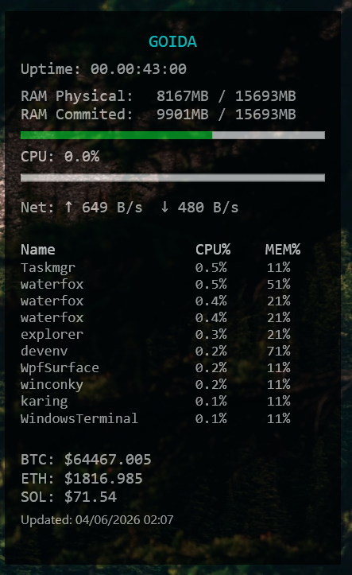

# winconky

A lightweight desktop overlay for Windows, inspired by [Conky](https://github.com/brndnmtthws/conky) on Linux. Built with WPF, it sits on your desktop and shows live system stats — without cluttering your taskbar or Alt+Tab switcher.

  

---

## Features

- **CPU & RAM** usage with progress bars
- **Network** activity
- **Top processes** by CPU and memory
- **Cryptocurrency prices** (live)
- Semi-transparent, always-on-desktop overlay
- Hidden from taskbar and Alt+Tab

---

## Screenshot



---

## Requirements

- Windows 10 or later
- .NET 6+ (or whichever version you target)

---

## Getting Started

1. Clone the repo:
   ```bash
   git clone https://github.com/dubkooooooooooooov/winconky.git
   ```
2. Open `winconky.sln` in Visual Studio
3. Build and run (`F5`)

The overlay will appear on your desktop. It does not show in the taskbar or Alt+Tab.

---

## Configuration

You can tweak the following directly in `MainWindow.xaml`:

| Property | Default | Description |
|---|---|---|
| `Opacity` | `0.7` | Overlay transparency |
| `Width` / `Height` | `423` / `696` | Overlay size |
| `Topmost` | `False` | Pin above all windows |
| `Background` | `Black` | Background color |

---

## How It Hides from Alt+Tab

WPF windows with `ShowInTaskbar="False"` still appear in Alt+Tab by default. winconky works around this by:

1. Spawning a hidden `ToolWindow` as the owner window
2. Applying the `WS_EX_TOOLWINDOW` extended style via WinAPI

This is the same technique used by screen capture tools and HUD overlays.

---

## Project Structure

```
winconky/
├── MainWindow.xaml         # UI layout
├── MainWindow.xaml.cs      # Logic, timers, WinAPI calls
└── winconky.csproj
```

## License

MIT
